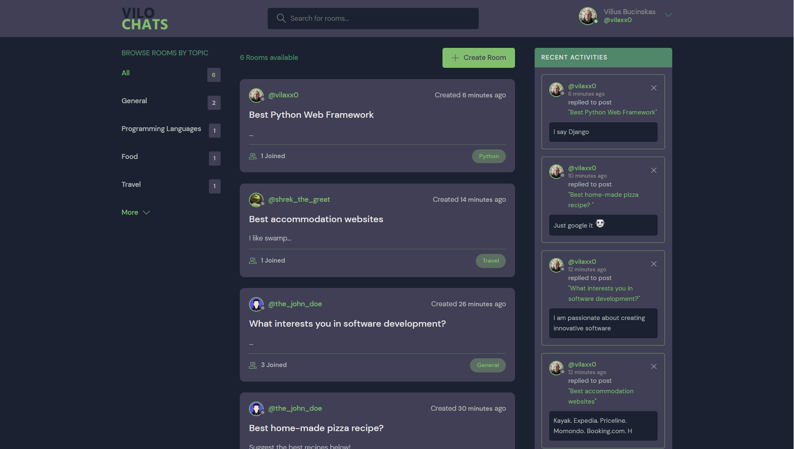
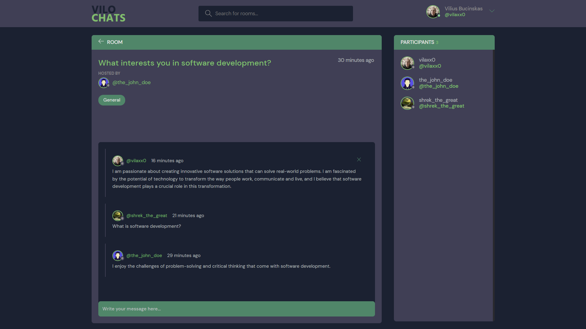
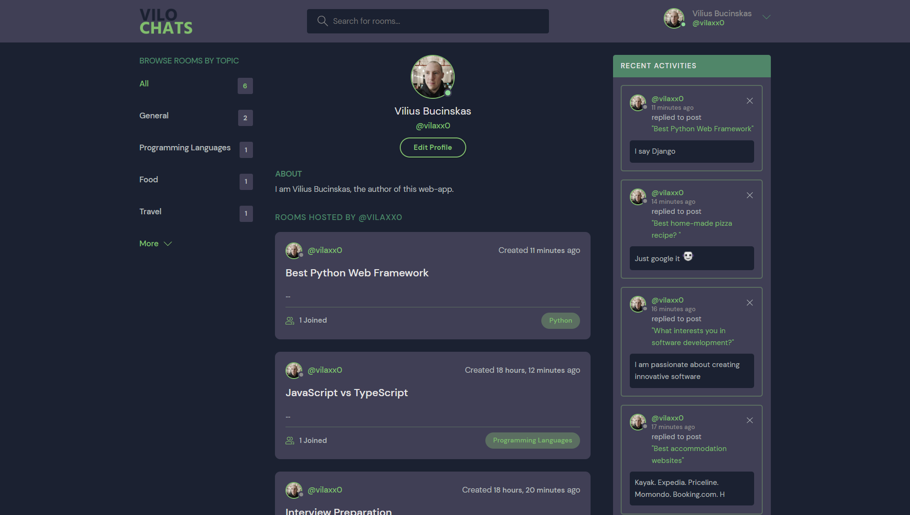
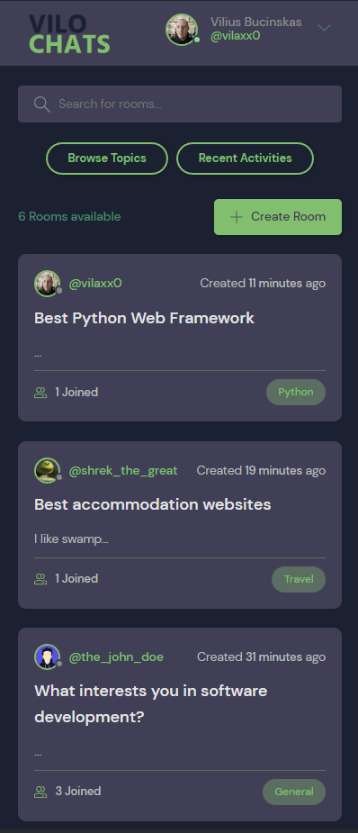
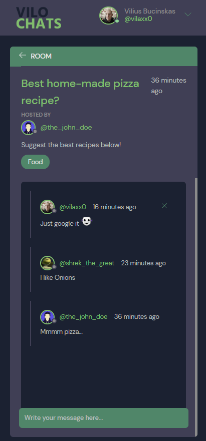
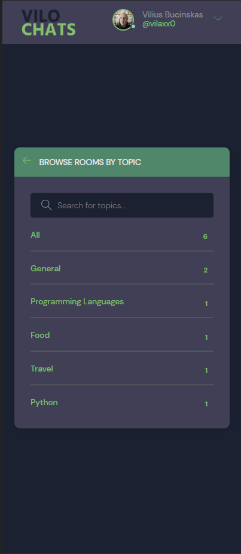

# ChatRooms

The project is a web-based chat application that enables users to join chat rooms based on different topics. The application is built using Django framework and features live chat functionality that allows users to discuss the selected topic in real-time. The front-end of the application is created using Django built-in Template Engine, while sqlite3 is used as the database. With this project, users can connect with like-minded individuals and share their ideas, opinions, and knowledge on various topics.

## Prerequisites

To run this project on your local machine, you will need to have the following installed:

- Python 3.x
- pip (Package manager for Python)

## Installation

To install and run the project, follow these steps:

1. Clone the repository:

```bash
https://github.com/vilaxx0/Chat-Rooms.git
```

2. Navigate to the project's root directory:

```bash
cd Chat-Rooms/
```

3. Create a virtual environment using virtualenv:

```bash
virtualenv env
```

If you don't have virtualenv installed, you can install it using pip:

```bash
pip install virtualenv
```

4. Activate the virtual environment:

```bash
.\env\Scripts\activate
```

5. Install the required Python packages:

```bash
pip install -r requirements.txt
```

6. Run the migrations:

```bash
python manage.py migrate
```

7. Run the development server:

```bash
python manage.py runserver
```

> ⚠ Then, the development server will be started at http://127.0.0.1:8000/

### API

API was built using Django REST framework module.

All available URL Endpoints:

    'GET /api/'

    'GET /api/rooms/'

    'GET /api/rooms/[str:pk](str:pk)/'

URL Endpoints to implement:

    'POST /api/rooms/create/'

    'POST /api/rooms/[str:pk](str:pk)/update/'

    'DELETE /api/rooms/[str:pk](str:pk)/delete/'

    'GET /api/rooms/[str:pk](str:pk)/messages/'

    'POST /api/rooms/[str:pk](str:pk)/messages/create/'

    'DELETE /api/rooms/[str:pk](str:pk)/messages/[str:pk](str:pk)/delete/'

    'GET /api/rooms/[str:pk](str:pk)/participants/'

### App Preview Desktop/Mobile View :

<div style="display:flex; flex-direction: row; padding: 10px;">
  
  
  
  
  
  
  
  
</div>

## Contributing

If you want to contribute to this project, please follow these steps:

1. Fork the repository.
2. Clone the dev branch of the repository:

```bash
git clone -b dev https://github.com/vilaxx0/Chat-Rooms.git
```

3. Create a new branch with a descriptive name:

```bash
git checkout -b feature/your-feature-name
```

4. Make your changes.
5. Test your changes.
6. Commit your changes and push them to your forked repository:

```bash
git add .
git commit -m "your commit message"
git push origin feature/your-feature-name
```

7. Create a pull request from your feature branch to the dev branch of the original repository.
8. Wait for feedback or approval from the project maintainers.
9. Once your pull request is merged, you can safely delete your feature branch.

Note: The master branch of the repository is for production. Please do not contribute directly to the master branch.
